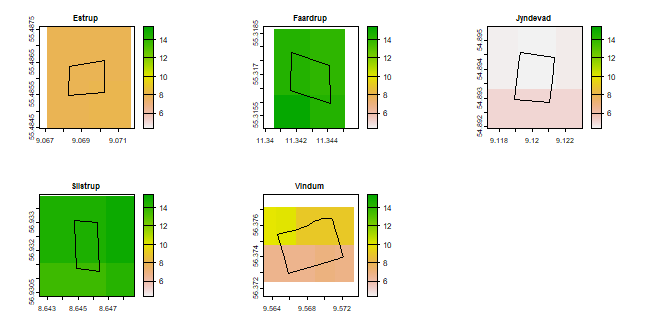

<!-- README.md is generated from README.Rmd. Please edit that file -->

# soilscaler

<!-- badges: start -->
<!-- badges: end -->

The R package soilscaler contains functions to downscale
coarse-resolution soil maps to higher resolutions by combining
high-resolution covariates with soil observations from other sites. The
goal of the package is to provide a workflow which is userfriendly and
straightforward, while being flexible enough to allow experimentation.

## 1 Installation

You can install the development version of soilscaler from
[GitHub](https://github.com/) with:

``` r
# install.packages("devtools")
devtools::install_github("anbm-dk/soilscaler")
```

## 2 Input data

The main function for the package is `make_downscaler`, which fits
prediction models for downscaling and tests their accuracies using
leave-site-out cross-validation.

The required inputs for the function include:

1.  Soil observations for each site, as list of `SpatVector` point
    objects. The data sets can contain different numbers of points, but
    the column names and formats must match.
2.  High-resolution covariates for each site, as a list of `SpatRaster`
    objects. The number of layers and the layer names must match.
3.  A coarse-resolution input map in `SpatRaster` format. The input map
    is technically optional. However, some of the features in the
    function depend on the input map and become unavailable if it is
    absent.

The package contains data examples for the inputs. Firstly,
`DK_observations` are soil observations from five research fields in
Denmark. The function `list_unwrap` unwraps the data.

``` r
library(terra)
#> terra 1.7.3
library(magrittr)
#> 
#> Vedhæfter pakke: 'magrittr'
#> De følgende objekter er maskerede fra 'package:terra':
#> 
#>     extract, inset
library(soilscaler)

my_obs <- list_unwrap(DK_observations, "EPSG:25832")

par(mfrow = c(2, 3))

for (i in 1:5) {
  plot(my_obs[[i]], "clay", main = names(my_obs)[i])
}
```


Secondly, the package contains lists with electromagnetic induction
(EMI) measurements (`DK_EC`) and bare soil aerial photos (`DK_RGB`) from
the fields, as examples of high-resolution covariates.

``` r
my_EC  <- list_unwrap(DK_EC, "EPSG:25832")
my_RGB <- list_unwrap(DK_RGB, "EPSG:25832")

par(mfrow = c(2, 3))
for (i in 1:5) {
  plot(my_EC[[i]], main = names(my_obs)[i])
}

par(mfrow = c(2, 3))
```


``` r
for (i in 1:5) {
  plotRGB(my_RGB[[i]], mar = c(0, 0, 2, 0), main = names(my_obs)[i])
}

my_covariates <- list()
for(i in 1:5) {
  my_covariates[[i]] <- c(my_EC[[i]], my_RGB[[i]])
}
```


Lastly, the package contains an example of a coarse resolution input
map. This map contains clay and soil organic carbon in the areas
surrounding the fields, extracted from [SoilGrids250m
2.0](https://soilgrids.org/). Here we use the clay contents from this
map.

``` r
data("DK_fields")

my_fields <- unwrap(DK_fields)
crs(my_fields) <- "EPSG:25832"

my_input <- DK_soilgrids %>% unwrap() %>% subset(1)
crs(my_input) <- "EPSG:4326"

par(mfrow = c(2, 3))

for (i in 1:5) {
  e <- my_fields[i] %>%
    ext() %>%
    extend(., 100) %>%
    project(., "EPSG:25832", "EPSG:4326")
  
  plot(
    my_input,
    main = names(my_obs)[i],
    ext = e, type = "continuous",
    range = minmax(my_input)
    )
  
  plot(project(my_fields[i], "EPSG:4326"), add = TRUE)
}
```



## 3 Downscaling

### 3.1 Default settings

We can now use the data in the function `make_downscaler`. In addition
to the inputs, we specify the name of the column containing the target
variable, and we set `plot_results = TRUE`, which creates a correlation
plot for the results. The function handles projections internally, so
the input maps do not need to have the same projection as the
observations and covariates (but observations and covariates must still
have the same projection for each site).

``` r
downscaler1 <- make_downscaler(
  obs          = my_obs,
  cov          = my_covariates,
  input        = my_input,
  targ_name    = "clay",
  plot_results = TRUE
)
#> Indlæser krævet pakke: ggplot2
#> Indlæser krævet pakke: lattice

downscaler1$accuracy
#> # A tibble: 5 × 5
#>   site     RMSE_in RMSE_out  cor_in cor_out
#>   <chr>      <dbl>    <dbl>   <dbl>   <dbl>
#> 1 Estrup     4.11     4.31  -0.329    0.605
#> 2 Faardrup   2.23     2.15   0.0587   0.482
#> 3 Jyndevad   0.526    0.673 -0.0581   0.491
#> 4 Silstrup   2.36     2.32   0.304    0.583
#> 5 Vindum     3.05     2.34  -0.322    0.476

downscaler1$plot
#> Warning: Removed 5 rows containing missing values (`geom_point()`).
```


``` r

par(mfrow = c(2, 3))
for (i in 1:5) {
  plot(downscaler1$output_maps[[i]], main = names(my_obs)[i])
}
```


The output also contains a general prediction model for all the sites
and the individual models used for leave-site-out predictions.

``` r
downscaler1$model_general$finalModel
#> 
#> Call:
#> lm(formula = .outcome ~ ., data = dat)
#> 
#> Coefficients:
#> (Intercept)  EC_00_25_cm          red        green         blue  
#>   1.635e-02    2.745e-01    2.403e-01   -2.635e-01   -1.956e-05

library(dplyr)
#> 
#> Vedhæfter pakke: 'dplyr'
#> De følgende objekter er maskerede fra 'package:terra':
#> 
#>     intersect, union
#> De følgende objekter er maskerede fra 'package:stats':
#> 
#>     filter, lag
#> De følgende objekter er maskerede fra 'package:base':
#> 
#>     intersect, setdiff, setequal, union

lapply(
  downscaler1$models_leave_site_out,
  function(x) x$finalModel$coefficients
  ) %>%
  bind_rows()
#> # A tibble: 5 × 5
#>   `(Intercept)` EC_00_25_cm     red  green     blue
#>           <dbl>       <dbl>   <dbl>  <dbl>    <dbl>
#> 1       0.0282        0.416  0.231  -0.265  0.0163 
#> 2      -0.00194       0.290  0.288  -0.319 -0.00112
#> 3       0.0301        0.285  0.310  -0.327 -0.0212 
#> 4       0.0173        0.266  0.260  -0.310  0.0274 
#> 5       0.0418        0.174 -0.0487  0.192 -0.140
```

### 3.2 Scaling

With the default settings, the function centers the observations and
covariates for each site and add the input map to the predictions as a
flat baseline. In addition to these centering operations, the function
has options for scaling the observations and/or covariates relative to
the input (It can also scale covariates by their standard deviations).

``` r
downscaler2 <- make_downscaler(
  obs          = my_obs,
  cov          = my_covariates,
  input        = my_input,
  targ_name    = "clay",
  scale_cov    = "by_input",
  scale_obs    = TRUE,
  plot_results = TRUE
)

downscaler2$accuracy
#> # A tibble: 5 × 5
#>   site     RMSE_in RMSE_out  cor_in cor_out
#>   <chr>      <dbl>    <dbl>   <dbl>   <dbl>
#> 1 Estrup     4.11     3.90  -0.329    0.598
#> 2 Faardrup   2.23     2.15   0.0587   0.508
#> 3 Jyndevad   0.526    0.470 -0.0581   0.323
#> 4 Silstrup   2.36     2.28   0.304    0.636
#> 5 Vindum     3.05     2.22  -0.322    0.656

downscaler2$plot
#> Warning: Removed 5 rows containing missing values (`geom_point()`).
```


### 3.3 Input map as a covariate

In addition to its role as a baseline for prediction, the input map can
serve as an additional covariate.

``` r
downscaler_input <- make_downscaler(
  obs          = my_obs,
  cov          = my_covariates,
  input        = my_input,
  targ_name    = "clay",
  input_as_cov = TRUE,
  center_cov   = FALSE,
  plot_results = TRUE
)

downscaler_input$accuracy
#> # A tibble: 5 × 5
#>   site     RMSE_in RMSE_out  cor_in cor_out
#>   <chr>      <dbl>    <dbl>   <dbl>   <dbl>
#> 1 Estrup     4.11     3.18  -0.329    0.613
#> 2 Faardrup   2.23     1.93   0.0587   0.409
#> 3 Jyndevad   0.526    0.719 -0.0581   0.533
#> 4 Silstrup   2.36     2.22   0.304    0.555
#> 5 Vindum     3.05     1.81  -0.322    0.394

downscaler_input$model_general$finalModel
#> 
#> Call:
#> lm(formula = .outcome ~ ., data = dat)
#> 
#> Coefficients:
#> (Intercept)        input  EC_00_25_cm          red        green         blue  
#>    -3.67196     -0.16653      0.14720      0.24507     -0.16234     -0.08525

downscaler_input$plot
#> Warning: Removed 5 rows containing missing values (`geom_point()`).
```


### 3.4 Model types

The default prediction model uses linear regression. Other model types
can be passed on to `caret::train()` through the argument `model_type`.

``` r
library(randomForest)

downscaler_rf <- make_downscaler(
  model_type   = "rf",
  obs          = my_obs,
  cov          = my_covariates,
  input        = my_input,
  targ_name    = "clay",
  scale_cov    = "by_input",
  scale_obs    = TRUE
)

downscaler_rf$accuracy
#> # A tibble: 5 × 5
#>   site     RMSE_in RMSE_out  cor_in cor_out
#>   <chr>      <dbl>    <dbl>   <dbl>   <dbl>
#> 1 Estrup     4.11     3.94  -0.329    0.538
#> 2 Faardrup   2.23     2.03   0.0587   0.426
#> 3 Jyndevad   0.526    0.650 -0.0581   0.215
#> 4 Silstrup   2.36     2.18   0.304    0.640
#> 5 Vindum     3.05     2.26  -0.322    0.606

varImp(downscaler_rf$model_general)
#> rf variable importance
#> 
#>             Overall
#> EC_00_25_cm 100.000
#> red          12.822
#> green         1.774
#> blue          0.000
```

## 3.5 Minimal objects

As previously mentioned, the input map is optional (but recommended).
Further options can omit prediction models from the results and turn off
the automatic generation of output maps, which can sometimes be
convenient.

``` r
library(randomForest)

downscaler_lite <- make_downscaler(
  obs          = my_obs,
  cov          = my_covariates,
  targ_name    = "clay",
  keep_models  = FALSE,
  make_maps    = FALSE
)

downscaler_lite
#> $accuracy
#> # A tibble: 5 × 3
#>   site     RMSE_out cor_out
#>   <chr>       <dbl>   <dbl>
#> 1 Estrup       2.83  0.601 
#> 2 Faardrup     3.10  0.510 
#> 3 Jyndevad     6.92  0.472 
#> 4 Silstrup     7.05  0.643 
#> 5 Vindum       2.11  0.0594
```

## Future additions

- Option to pass additional arguments to `caret::train()`
- Option to use a log transformation internally.
- A prediction function for new sites.
- A bootstrapping procedure for uncertainty assessment.
- An option scale `obs` and `cov` relative to the input uncertainty.
- Make covariates optional, using input as a replacement.
